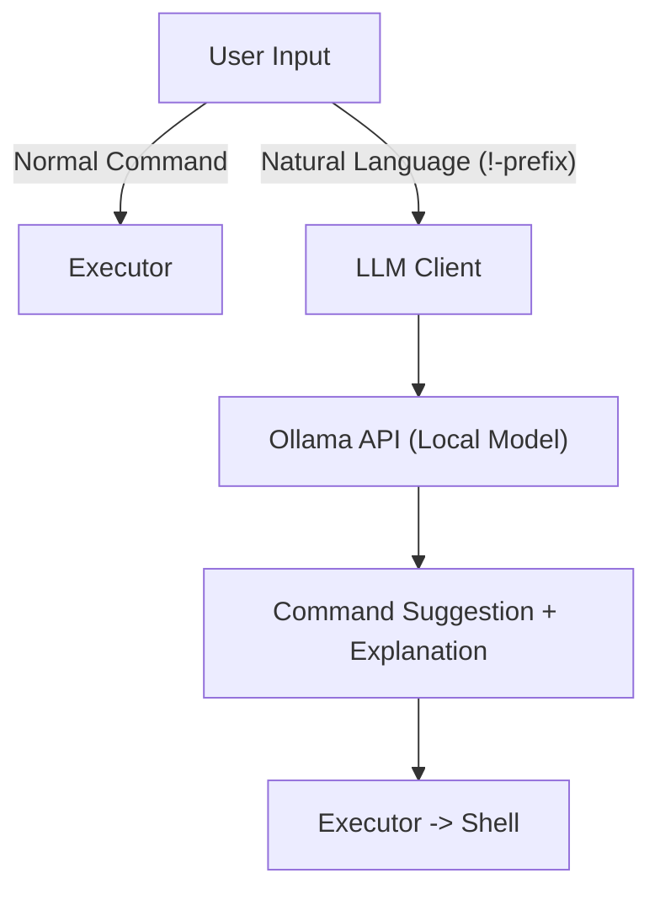

# 🧠 SuperTerm  
### AI-Powered Terminal Assistant for Ubuntu & Linux

**SuperTerm** is an intelligent command-line interface that blends the power of a Linux shell with the understanding of AI.  
It lets you type natural-language commands (e.g., `!show large log files`) and translates them into real shell operations — while explaining every action before it runs.

SuperTerm connects to a **local Ollama server** for reasoning, allowing you to run open LLMs like `llama3`, `mistral`, or `phi3` fully offline on your own system.

---

## 🌍 Overview

SuperTerm brings **AI to your terminal** — locally, securely, and transparently.  
It runs a small Python application on top of your system shell and communicates with an [Ollama](https://ollama.com) instance running in the background.

You can:
- run commands normally (`ls`, `grep`, etc.), or  
- ask for things conversationally (`!find all python files modified today`)  

SuperTerm interprets your intent, proposes a shell command, explains what it will do, and executes it safely inside your terminal.

---

## 🚀 Key Features

- 🗣️ **Natural-Language Commands** — Use `!` to ask questions instead of memorizing syntax.  
- 💡 **Explanations** — Before execution, SuperTerm explains what the command does.  
- 🧩 **Persistent History** — Stores only executed commands in `~/.superterm_cmd_history`.  
- 🧠 **Local AI Model Integration** — Uses Ollama for local, private, offline reasoning.  
- 🪄 **Desktop Launcher** — Automatically adds an icon to your Ubuntu desktop and menu.  
- 🔒 **No Cloud Calls** — Everything runs locally; no internet required after install.

---

## 🧰 Requirements

- Ubuntu 22.04+ or any modern Linux distro  
- `python3`, `python3-venv`, and `pip`  
- [Docker](https://docs.docker.com/get-docker/) (for Ollama GPU support, optional)  
- [Ollama](https://ollama.com) (the local AI server)

---

## 🧠 Dependency: Ollama Server

SuperTerm depends on the **Ollama** server to interpret natural language.  
You must have Ollama running before launching SuperTerm.

### 🔗 Official Setup Instructions
👉 [https://hub.docker.com/r/ollama/ollama](https://hub.docker.com/r/ollama/ollama)

### 🐋 Run Ollama via Docker (recommended)

```bash
docker run -d --gpus=all   -v ollama:/root/.ollama   -p 11434:11434   --name ollama   ollama/ollama
```

### 🧩 Pull a Model

```bash
docker exec -it ollama ollama pull llama3
```

Then verify the model is available:

```bash
curl http://localhost:11434/api/tags
```

Expected output:
```json
{"models":[{"name":"llama3","size":4739569664}]}
```

---

## 🛠️ Installation (SuperTerm)

Clone and install:

```bash
git clone https://github.com/<your-username>/superterm.git
cd superterm
chmod +x install.sh
./install.sh
```

During setup you can:
- install Ollama locally  
- connect to an existing Docker instance  
- or skip Ollama setup for now  

The script automatically:
- creates a Python virtual environment (`.superterm_env`)  
- installs dependencies (`typer`, `rich`, `requests`)  
- installs SuperTerm in editable mode  
- creates a desktop launcher (`SuperTerm.desktop`)  

---

## 💬 Usage

### 🧩 Run from Terminal
```bash
cd /path/to/superterm
source .superterm_env/bin/activate
superterm
```

### 🖥️ Or run from the Desktop
Look for **“SuperTerm – AI Terminal”** in your Applications menu or on your Desktop.

---

## 💡 Example Queries

| You Type | SuperTerm Does |
|-----------|----------------|
| `ls -la` | Runs the command normally |
| `!list all docker containers` | Suggests `docker ps -a` and explains it |
| `!show me CPU usage` | Runs `top` or `htop` |
| `!find large files over 1GB` | Suggests `find / -type f -size +1G` |
| `!what’s using my GPU?` | Uses `nvidia-smi` if available |

---

## ⚙️ How It Works

1. You type a query (plain command or prefixed with `!`).  
2. SuperTerm sends natural-language requests to your local **Ollama server**.  
3. The LLM returns a suggested shell command and explanation.  
4. You review it — and SuperTerm executes it safely.  

---

## 🧠 Architecture Diagram



---


## 🪪 License

**MIT License** © 2025 Vinith Raj  
Free for personal use

---

> _“SuperTerm doesn’t replace your shell — it teaches it to understand you.”_
